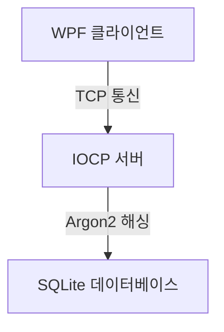

# IOCP-Chat-System

IOCP 기반 비동기 서버와 WPF 클라이언트로 구성된 채팅 시스템입니다.  
클라이언트는 단순 구조를 위해 동기 I/O를 사용하고, 송수신을 스레드로 분리하여 블로킹을 분산 처리했습니다.  
본 프로젝트는 IOCP 기반 비동기 처리 구조와 서버 설계 이해를 목적으로 구현되었습니다.

---

## 📌 시스템 구조

---

## 📌 기술 스택

### 서버
- C++
- WinSock2
- IOCP (I/O Completion Port)

### 클라이언트
- WPF (.NET)

### 외부 라이브러리
- libsodium  
  → 비밀번호 암호화

- SQLite  
  → 사용자 정보 저장

---

## 📌 주요 기능 및 구현

### 클라이언트/서버 구조
- IOCP 기반 비동기 송수신 처리.
- 워커 스레드 풀 사용.
- 다중 클라이언트 동시 접속 처리.
- WPF 클라이언트를 통한 채팅 인터페이스 제공.
- 클라이언트는 송신/수신을 각각 별도 스레드로 분리.
- 각 스레드는 동기 방식(send/recv)으로 통신 처리.

### 동기화 처리
- Critical Section 기반 스레드 동기화

### 데이터 인증 및 보안
- libsodium 기반 비밀번호 해싱 (Argon2)
- SQLite 기반 사용자 정보 저장

---

## 📌 학습 기록

네트워크 학습 과정은 아래 저장소에서 확인할 수 있습니다.
- https://github.com/cjw7823/LearnNetwork-socket
